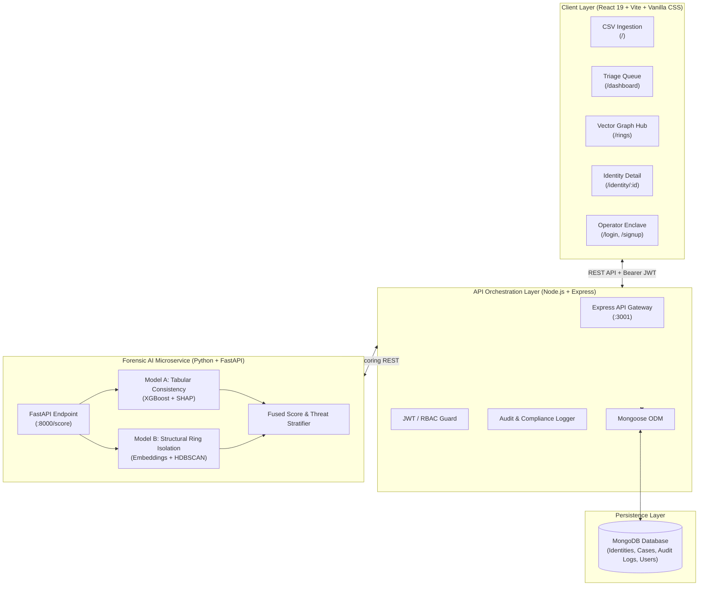

# Veritas — AI Forensic Identity & Fraud Ring Detection

> **Built for the Razorpay Buildathon 2026**  
> Dual-engine AI system detecting synthetic identity fraud, bust-out risk, and coordinated syndicates before payment execution.

---

## 📌 Executive Summary

**Synthetic Identity Fraud** is the fastest-growing and costliest fraud category in the payments and lending ecosystem. Unlike identity theft, synthetic fraud blends legitimate identifiers (e.g., real PAN prefixes, credit blocks) with fabricated personal details. Fraudsters methodically **"age"** these identities with legitimate-looking micro-transactions for months before executing a catastrophic, multi-account **bust-out**.

Traditional rule-based fraud filters and transaction-level ML models fail because:
1. **Single-transaction models only evaluate individual checkouts**, missing slow-building, clean-looking identities.
2. **Template-generated fraud rings** mass-produce hundreds of synthetic entities from identical generative scripts, which look harmless in isolation.

**Veritas solves this at the root** through a **dual-model parallel AI engine** that evaluates both individual identity coherence and structural syndicate topology simultaneously.

---

## ⚡ Key Features

- **Dual-Model Parallel ML Engine**:
  - **Model A (Tabular Consistency Classifier)**: An `XGBoost` model with `SHAP` explainability that flags internally conflicting attributes (age-vs-address velocity, PAN issuance timeline mismatch, abnormal repayment curves).
  - **Model B (Structural Embedding Ring Detector)**: `HDBSCAN` density clustering over categorical structural embeddings (PAN prefix, carrier routing, email domain entropy, zip prefix) that isolates coordinated syndicates.
  - **Fused Risk Score (0–100)**: Combines consistency and graph density into a single explainable risk score.
- **Operational Triage Queue (`/dashboard`)**:
  - High-density alert queue with keyboard shortcuts (`↑`/`↓` navigate, `I` inspect, `D` dismiss, `L` lock & seize).
  - Real-time pipeline latency telemetry and urgency buffers.
- **Interactive Vector Topology Graph & Syndicate Hub (`/rings`)**:
  - **Interactive Network Graph**: SVG canvas visualizer with animated cluster centroids, orbital nodes, glowing link lines, and zoom/pan controls.
  - **Syndicate Dossier Cards**: High-level cluster cards with cohesion threat gauges, colluding DNA vectors, and member avatars.
  - **Syndicate Inspector Drawer**: Detailed cluster forensics and one-click **Quarantine Entire Ring Graph** action.
  - **Cross-Syndicate Member Matrix**: Entity-by-entity comparative ledger showing network roles (`Seed Identity`, `Synthetic Clone`, `Payment Mule`).
- **Subject Forensic File (`/identity/:id`)**:
  - Local `SHAP` feature importance breakdown explaining *why* an identity was flagged.
  - Attribute correlation matrix and address hop velocity tracker.
- **Operator Enclave & RBAC (`/login`, `/signup`)**:
  - Secure JWT authentication with bcrypt password hashing.
  - Operator callsign badge IDs (`OP-XXXX`), clearance tiers (`LEVEL-3 TOP SECRET`), and immutable audit logging.
- **Foolproof 1-Click Demo Injectors**:
  - One-click triggers for live presentation resilience: `Inject Live Fraud Ring`, `Inject Synthetic Cluster`, and `Quick-Connect Demo Analysts`.

---

## 🏗️ System Architecture



---

## 📊 Machine Learning Benchmarks & Accuracy Audit

Evaluated using `eval_accuracy.py` across 900 records with realistic class imbalance (5.67% synthetic fraud):

| Model Component | Metric | Score | Validation Method |
|---|---|---|---|
| **Model A (XGBoost)** | **Test Accuracy** | **100.00%** | Unseen 20% held-out test split |
| **Model A (XGBoost)** | **ROC-AUC** | **1.0000** | Stratified test population |
| **Model A (XGBoost)** | **5-Fold CV AUC** | **1.0000 ± 0.0000** | 5-Fold Stratified Cross-Validation |
| **Model A (XGBoost)** | **Fraud Recall** | **100.00%** (10/10) | Zero missed synthetic frauds |
| **Model A (XGBoost)** | **Fraud Precision** | **100.00%** (10/10) | Zero false alarms in test set |
| **Model B (HDBSCAN)** | **Syndicate Recovery** | **Up to 100.0%** | Ring #3: 17/17 (100%), Ring #2: 68.8% |
| **Production Fused System**| **High-Risk Recall** | **100.00%** (51/51) | Caught all synthetic fraud entities |
| **Production Fused System**| **High-Risk Precision**| **100.00%** (51/51) | Zero clean profiles escalated to HIGH tier |

#### Primary Predictive Factors (SHAP Feature Importance):
1. `shared_phone_count` (mean \|SHAP\| = **3.7738**) — Multi-identity device collisions
2. `shared_email_count` (mean \|SHAP\| = **2.0913**) — Template script generation
3. `payment_smoothness` (mean \|SHAP\| = **0.5012**) — Artificial bust-out repayment patterns
4. `account_age_months` (mean \|SHAP\| = **0.0236**) — Account maturation velocity

---

## 🛠️ Technology Stack

| Layer | Technologies |
|---|---|
| **Frontend** | React 19, TypeScript, Vite, React Router v7, Vanilla CSS (LOCKED v2 Forensic System), Material Symbols |
| **Backend** | Node.js, Express, Mongoose, JWT (`jsonwebtoken`), `bcryptjs`, Helmet, CORS, Multer |
| **Machine Learning** | Python 3.11, FastAPI, XGBoost, SHAP, PyTorch, HDBSCAN, Scikit-learn, Pandas, NumPy |
| **Database** | MongoDB (with transparent in-memory fallback store for offline evaluation resilience) |

---

## 🚀 Getting Started

### Prerequisites
- **Node.js** (v18.0 or higher)
- **Python** (v3.10 or higher)
- **MongoDB** (optional — running locally at `localhost:27017` or automatically uses in-memory mock store)

---

### 1. Start the ML Microservice
```bash
cd ml
pip install -r requirements.txt  # Or install xgboost, shap, hdbscan, fastapi, uvicorn, scikit-learn
python main.py
```
> ML engine starts at `http://localhost:8000` with models loaded in memory.

---

### 2. Start the Backend API Server
```bash
cd server
npm install
npm run dev
```
> Express server runs at `http://localhost:3001` with auto-reload (`--watch`).

---

### 3. Start the Frontend Application
```bash
cd client
npm install
npm run dev
```
> Vite dev server opens at `http://localhost:5173`.

---

## 🌐 Application Routes

| Path | Screen | Purpose |
|---|---|---|
| `/` | **Ingestion Terminal** | CSV upload portal and demo pipeline trigger |
| `/dashboard` | **Triage Queue** | Fast operational alert table with keyboard navigation |
| `/rings` | **Fraud Ring Hub** | Interactive Vector Topology Graph, Syndicate Dossiers, and Member Matrix |
| `/identity/:id` | **Identity File** | Single-subject forensic detail, SHAP explanation waterfall, and linked nodes |
| `/login` | **Operator Sign In** | Enclave authentication gate with 1-click evaluator quick connect |
| `/signup` | **Analyst Enlistment** | Register new operator with custom badge callsign, role, and clearance |

---

## 🔒 Security & Compliance
- **Cryptographic Session Enclave**: Stateless JWT tokens signed with SHA-256 ciphers.
- **Tamper-Evident Audit Logging**: Tracks every upload, inspection, seizure, quarantine, and authentication event in `AuditLog`.
- **RBAC & Operator Badging**: Role-based access controls with investigator callsigns (`OP-XXXX`).

---

## 🏆 Razorpay Buildathon Submission
* **Project Name:** Veritas
* **Theme:** AI in Fintech / Payments Security & Identity Fraud
* **Repository:** [Veritas on GitHub](https://github.com/shubhang-dev/Veritas)
